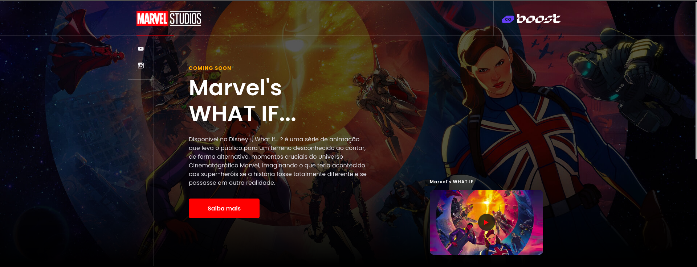

# Projeto What If...?

Este é um projeto de projeto para a série "What If...?" da Marvel, desenvolvido com Next.js, Stitches para estilização, Prismic para gerenciamento de conteúdo e TypeScript. Este projeto faz parte do meu portfólio pessoal e destina-se a demonstrar minhas habilidades de desenvolvimento web.

**Link para o projeto em produção**: [Projeto What If...?](https://what-if-project.vercel.app/)

## Visão Geral

O objetivo deste projeto é criar um projeto envolvente que forneça informações sobre a série "What If...?".

## Requisição de Personagens e Conteúdo

Para proporcionar aos visitantes uma experiência envolvente, o projeto utiliza o Prismic para gerenciamento de conteúdo. Isso nos permite recuperar dinamicamente informações sobre personagens e outros detalhes relacionados à série diretamente de uma fonte de conteúdo centralizada.

Aqui está como lidamos com a requisição de personagens e conteúdo:

- **Personagens**: Utilizamos o Prismic para armazenar e gerenciar informações detalhadas sobre personagens da série. Isso inclui descrições, imagens, biografias.

## Recursos

O projeto contém os seguintes recursos:

- **Página Inicial**: Apresentação da série e teaser.

- **Trailer**: Reprodução do trailer oficial da série.

- **Listagem dos Personagens**: Uma coleção de imagens dos personagens de "What If...?".

## Tecnologias Utilizadas

- Next.js
- Stitches (para estilização)
- Prismic (para gerenciamento de conteúdo)
- TypeScript

## Como Contribuir

Este projeto faz parte do meu portfólio pessoal e não está aberto para contribuições externas. No entanto, sinta-se à vontade para explorar o código-fonte e as estruturas utilizadas como referência.

## Autor

Este projeto foi desenvolvido por Arthur César como parte do seu portfólio pessoal.

---

Espero que este projeto demonstre minhas habilidades de desenvolvimento web e contribua para o meu portfólio pessoal. Divirta-se explorando as diferentes realidades de "What If...?"!
